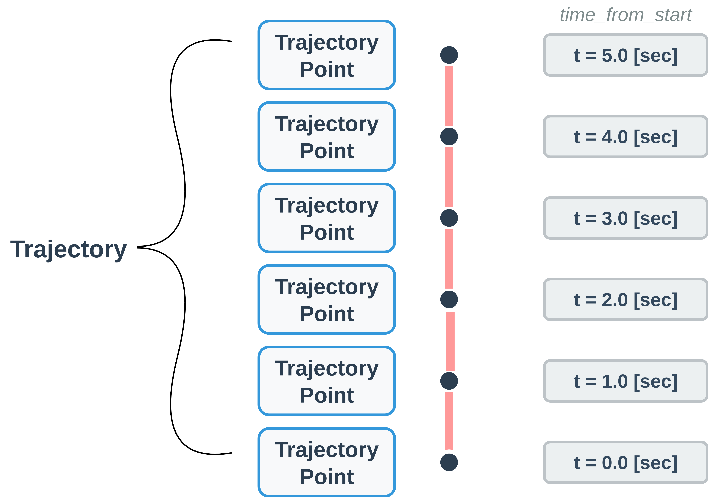

# Design: Sample ROS Node(VLM Planner)

!!! success "このページの想定読者"

    - sample nodeが使用する入出力形式を知って、自分自身でML plannerのnodeを作成したい方
    - sample nodeの入力画像データはどういうものか、出力する軌道データはどういうものか知って勉強したい方

このページでは、Sampleとして提供している[VLM Planner](https://github.com/AutomotiveAIChallenge/e2e-utils-beta/tree/main/src/vlm_planner)の構成について解説します。これを参考に、自分自身で作成したplannerをautowareに結合してみてください。

## Input/Output概略

- 基本構成としては、画像を入力し、trajectoryを出力するという設計になっています。
- 画像の他にも、以下のような情報を含むtopicを入力として受け取っています。
  - kinematic_state, acceleration: 車両の現在状態の情報
- 出力するtrajectoryはwaypointの形式で表現されています。
  - VLM Plannerでは、`base_Link`座標系で表現されたtrajectoryを出力します。

```mermaid
graph LR
    SampleNode["Sample<br>ROS node"]
    
    Sensing -- "/sensing/camera/image_raw" --> SampleNode
    Localization -- "/localization/kinematic_state<br>/localization/acceleration" --> SampleNode
    
    SampleNode -- "/planning/ml_planner/auto/trajectory" --> Control
```

## Input/Output詳細

### Input詳細

入力データのTopic Name,Type,QoSを以下に示します。

| Topic Name | Type | QoS |
|------------|------|-----|
| `/sensing/camera/image_raw` | [`sensor_msgs/msg/Image`](https://docs.ros.org/en/humble/p/sensor_msgs/msg/Image.html) | Reliability=BEST_EFFORT, Durability=VOLATILE |
| `/localization/kinematic_state` | [`nav_msgs/msg/Odometry`](https://docs.ros.org/en/humble/p/nav_msgs/msg/Odometry.html) | Reliability=RELIABLE, Durability=VOLATILE |
| `/localization/acceleration` | [`geometry_msgs/msg/AccelWithCovarianceStamped`](https://docs.ros.org/en/humble/p/geometry_msgs/msg/AccelWithCovarianceStamped.html) | Reliability=BEST_EFFORT, Durability=VOLATILE |

ROS 2においてNodeを作成する際には、[QoS](https://docs.ros.org/en/humble/Concepts/Intermediate/About-Quality-of-Service-Settings.html)に注意が必要です。たとえTopic NameとTypeが合っていても、QoSが間違っていると正しくpublish/subscribeができない場合があります。

AWSIMより出力される画像の解像度は`1920*1080`です。modelに入力する際には、適切なサイズへ変換を行ってください。

`/localization/kinematic_state`は現在位置や速度の情報を保持しています。それぞれの情報がどの座標系で表現されているのかを`frame_id`で確認する必要があります。詳細は[`nav_msgs/msg/Odometry`](https://docs.ros.org/en/humble/p/nav_msgs/msg/Odometry.html)を確認してください。

### Output詳細: 軌道データ（waypoints）

出力データであるtrajectoryのTopic Name,Type,QoSを以下に示します。

| Topic Name | Type | QoS |
|------------|------|-----|
| `/planning/ml_planner/auto/trajectory` | [`autoware_auto_planning_msgs/msg/Trajectory`](https://github.com/tier4/autoware_auto_msgs/blob/tier4/main/autoware_auto_planning_msgs/msg/Trajectory.idl) | Reliability=BEST_EFFORT, Durability=VOLATILE |

Trajectoryは、点列(waypoints)の形式で表現されています。
各点([`autoware_auto_planning_msgs/msg
/TrajectoryPoint`](https://github.com/tier4/autoware_auto_msgs/blob/tier4/main/autoware_auto_planning_msgs/msg/TrajectoryPoint.idl))には、

- 何秒後に
- どの点に向かうべきか
- その際の速度はいくつであるべきか

というような情報が格納されています。この点を並べたものをTrajectoryとして使用しています。

## 自作のPlannerを結合するには

- 自作のPlannerのInput/Outputを確認し、このページに載っているInput/Output topicに対応しているかどうか検討してみてください。
- うまく対応している場合は、Input/Output topicから自作PlannerのInput/Outputへの変換を実装することで、ROS Nodeを作成することができます。
- キャリブレーション情報が必要な場合、以下のtopicも使用可能です。

| Topic Name | Type | QoS |
|------------|------|-----|
| `/sensing/camera/camera_info` | [`sensor_msgs/msg/CameraInfo`](https://docs.ros.org/en/humble/p/sensor_msgs/msg/CameraInfo.html) | Reliability=BEST_EFFORT, Durability=VOLATILE |
| `/tf_static` | [`tf2_msgs/msg/TFMessage`](https://docs.ros.org/en/ros2_packages/humble/api/tf2_msgs/msg/TFMessage.html) | Reliability=RELIABLE, Durability=TRANSIENT_LOCAL |
